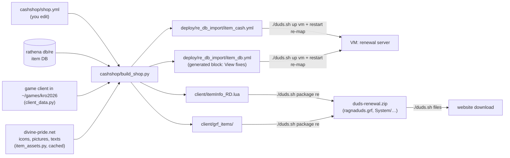

# Cash Shop, items and the game client

How the renewal Cash Shop is built, how the game client is made to show every item, and how our pictures get
into the game. Plus step-by-step procedures for the things you'll want to change later.

## The big picture



Every item exists twice:

| Where | What it holds | Files |
|---|---|---|
| **Server** (rAthena) | stats, effects, who can wear it, its **look number** (View) | `db/re/item_db_*.yml` + our `deploy/re_db_import/item_db.yml` |
| **Client** (the game) | name, description, **resource name** (picture file name), slots, look | the Lua item list in `System/` + pictures in GRF archives |

If the client doesn't know an item, it shows an apple with no name. If the client knows it but the picture files
are missing, the icon is empty. If the server sends a look the client has no sprite for, wearing it errors.
`build_shop.py` finds and fixes all three, for **every** server item (not only the shop's).

## The client's item list (Lua)

The 2026 exe loads one file, `System/itemInfo_true.lub` (our loader, `client/itemInfo_true.lub`). It builds one
big Lua table `tbl` in layers, each layer adding to or overriding the previous:

1. `System/itemInfo_original.lub`: the kRO list (Korean, complete for kRO; 32-bit Lua 5.1 bytecode)
2. `System/LuaFiles514/itemInfo.lua`: the English translation (ROenglishRE); English names win
3. `System/itemInfo_C.lua` (`tbl_custom`): our custom items (the event tickets)
4. `System/itemInfo_RD.lua` (`tbl_ragnaduds`): **generated** fixes, merged **field by field** (never removes
   anything the client already had)

Then the client runs `System/LuaFiles514/itemInfo_f.lua` `main()`, which registers every item with the exe:

```lua
AddItem(id, unidentifiedDisplayName, unidentifiedResourceName,
        identifiedDisplayName, identifiedResourceName, slotCount, ClassNum)   -- 7 arguments
AddItemIdentifiedDesc(id, line)   -- once per description line
```

Names must be strings and `slotCount` / `ClassNum` numbers. **One wrong value stops the whole registration**:
that's the "Item info file init: 7th argument must be a number" error, after which every later item is an apple.

An entry looks like this:

```lua
[450291] = {
    identifiedDisplayName     = "Amazing Grace",
    identifiedResourceName    = "Amazing_Grace",          -- picture file name (see below)
    identifiedDescriptionName = { "Prayer to the Lord ...", "ASPD + 10%.", ... },
    unidentifiedDisplayName   = "Amazing Grace", unidentifiedResourceName = "Amazing_Grace",
    unidentifiedDescriptionName = { "" },
    slotCount = 1, ClassNum = 0, costume = false          -- ClassNum: look number for headgears, else 0
},
```

## Pictures and looks

From the resource name the client builds these paths (Korean folder names, cp949):

| What | Path inside the game data |
|---|---|
| inventory / shop icon (24×24 BMP) | `data\texture\유저인터페이스\item\<name>.bmp` |
| big picture in the item window (75×100 BMP) | `data\texture\유저인터페이스\collection\<name>.bmp` |
| item on the floor | `data\sprite\아이템\<name>.spr` + `.act` |
| worn headgear | look number (View) → `accname` table → `data\sprite\악세사리\남\남<sprite>.spr` (and `여`) |
| worn garment | look number → `spriterobename` table → `data\sprite\로브\<sprite>\…` |

BMPs use **magenta (255,0,255) as transparent** (the client has no alpha channel).

## GRF archives and DATA.INI

A **GRF** is the game's archive format (like a zip): a header, the files (zlib), and a compressed file table with
each file's path stored as the client's own **cp949 bytes**. `DATA.INI` lists the archives the game reads, **line 0
first**; a file in an earlier archive wins over the same path in a later one.

What we ship (all built by `client/package_client.py` with `client/grf.py`):

```
[Data]
0=ragnaduds_login1.grf   ← login picture (t_login.jpg for the 2026 client, bgi_temp.bmp for older ones)
1=ragnaduds.grf          ← warning screen before the login + every fixed item picture
2=2026.grf               ← the client's own archives
3=data.grf
```

**Why GRFs, not loose files?** The client asks Windows for loose files by their Korean names in the *system code
page*. That works on a Western Windows (cp1252) and in Wine, but not on PCs with other language settings (e.g. the
"Unicode UTF-8" option): they silently fall back to the original pictures. Inside a GRF the names are raw bytes,
so it works on every PC.

The login picture changes at every start: the launcher (`launch.ps1` on Windows, `ragnaduds.sh` on Linux) rewrites
`DATA.INI` line 0 to the **next** login GRF (1, 2, 1, 2, …).

`grf.py` can also read and write GRFs by hand:
```bash
python3 client/grf.py some.grf list 유저인터페이스          # list files
python3 client/grf.py some.grf get "data\texture\…\t_login.jpg" out.jpg
```

## What build_shop.py does, item by item

For every item in the renewal server DB:

| Problem found | Fix |
|---|---|
| client has no entry | full entry in `itemInfo_RD.lua`: English name, official English description (divine-pride; a short one from the server data if divine-pride only has Korean), slots, look |
| client entry still in Korean | partial entry: English name / description only |
| no icon or floor sprite | real icon + big picture from divine-pride (converted to BMP); floor sprite **copied** from an item of the same kind (a made-up sprite could crash the game). Cards use the client's generic card icon |
| headgear / garment / costume / weapon look the client can't draw | server `View` changed in the generated block of `deploy/re_db_import/item_db.yml`: to the look named in `shop.yml` `looks:`, otherwise `0` (not drawn: no error) |

Last full run: 5,941 of 29,358 items fixed (3,962 new client entries, 392 translated, 1,537 looks, 16,632 picture
files). Divine-pride downloads are cached in `cashshop/.cache/dp/` (only the first run is slow).

## The Cash Shop

`cashshop/shop.yml` is the only file you edit:

```yaml
looks:                       # worn look for items whose own look the client can't draw
  19163: 400110              # item 19163 looks like item 400110

tab_labels:                  # what the game shows on each tab (server tab names are fixed)
  New: Beginner
  ...

tabs:
  New:
    note: "Beginner: Novice and 1st class rush gear"
    items:
      450183: 50             # Id (or AegisName): price in cash points
      1631: auto             # auto = by level: <100 → 100, 100-169 → 200, 170-189 → 400, 190+ → 600 (weapons ×1.5)
```

| Server tab | Shown as | Content |
|---|---|---|
| New | Beginner | Paradise / Eden / Novice rush gear, shadow starter gear, 1st class sets (Merchant Cart Revolution…) |
| Hot | 2nd Class | Paradise 2nd class weapons, 2nd / trans / expanded class sets (Alchemist/Creator Acid…) |
| Limited | 3rd Class | 3rd class sets for lv 100-160, per build |
| Rental | Endgame | 3rd class sets for lv 175-200, per build (Rune Knight Dragon Breath…) |
| Permanent | MVP Cards | |
| Scrolls | Refine | +14 / +19 safe certificates, Blacksmith Blessing, HD ores, costume enchant stones |
| Consumables | Consumables | tickets, manuals, mount, speed, stat foods, acid packs, Ygg, gems, homunculus, mercenaries |
| Other | Pets | eggs, food, accessories |
| Sale | Visuals | costumes |

The tab labels are written into the client's `data/msgstringtable.txt` by `package_client.py` (the 9 consecutive
lines "New / Popular / Limited Sale / …").

Where the sets come from: `cashshop/builds-*.md` (researched builds, every Id checked against the server DB),
read by `cashshop/research_sets.py`.

**Points** (`deploy/cash_points.txt`): +10 first login of the day, +5 per hour played (not AFK), +20 per MVP,
+2 per PvP kill; `@points` shows them; GMs give points with `!cash "Name" <n>`.
**Refine certificates** are used at the Refine Master, prontera 184,177 (`npc/re/merchants/ticket_refiner.txt`,
loaded in the renewal `map_conf.txt`).

## Other client changes made when packing (package_client.py)

- **No web pages**: every `http(s)://…` in the exe is zero-filled (same length) and every URL line in
  `msgstringtable.txt` emptied, so nothing opens on exit or from the Cash Shop "Charging" button.
- **Font**: the game's font is Gulim (Microsoft, can't be shipped). The Windows installer offers to install
  Microsoft's Korean fonts; the Linux installer uses a `gulim.ttc` placed next to `install.sh`.
- **Screens**: `build/installer/make_assets.py` makes `client/login/` (entrance.bmp, 1.jpg/.bmp, 2.jpg/.bmp) from
  the photos in `build/` (git-ignored).

## Procedures

### Add an item to the Cash Shop
1. Find its Id: `@iteminfo <name>` in game, or search `db/re/item_db_*.yml`.
2. Add `<id>: <price>` under the right tab in `cashshop/shop.yml`.
3. Build, check, ship:
   ```bash
   python3 cashshop/build_shop.py             # shop + client fixes (prints what it fixed)
   # validate the client item list (see "Validate" below)
   ./duds.sh package re && ./duds.sh files    # only if build_shop fixed something new for the client
   ./duds.sh up vm && ./duds.sh restart vm re-map
   ```
   If the item was already shown fine by the client, only the server part is needed (`up vm` + `restart re-map`):
   nobody has to reinstall.

### An item shows wrong in game (apple, no icon, Korean, sprite error)
Run `python3 cashshop/build_shop.py`: it re-checks every item. For a hat that should look like a specific other
hat, add it to `looks:` in `shop.yml`. Then package, upload, and friends REINSTALL.

### Add a brand new custom item (not in rAthena)
1. Server: add it to `deploy/re_db_import/item_db.yml` **above** the generated marker line (Id, AegisName, Name,
   Type, …), like the event tickets.
2. Client: add its name/description/resource name to `System/itemInfo_C.lua` (`tbl_custom`) in the dev client
   (`~/games/kro2026/…/System/`), and its pictures under that resource name (put them in `client/grf_items/…`
   after running `build_shop.py`, or reuse an existing item's resource name).
3. Validate, package, deploy as above.

### Validate the client item list (before every renewal package)
Runs the client's own registration code over the full list, with type checks like the exe:
```bash
S=/tmp/iteminfo-test; mkdir -p $S/System/LuaFiles514; C=~/games/kro2026/wine/drive_c/Gravity/kRO2026/System
cp $C/itemInfo_original.lub $C/itemInfo_C.lua $S/System/; cp $C/LuaFiles514/itemInfo.lua $C/LuaFiles514/itemInfo_f.lua $S/System/LuaFiles514/
cp client/itemInfo_true.lub client/itemInfo_RD.lua $S/System/
cat > $S/t.lua <<'EOF'
local n = 0
function AddItem(id, a, b, c, d, slots, look)
  for i, v in ipairs({a, b, c, d}) do if type(v) ~= "string" then return false, id .. ": name " .. i end end
  if type(slots) ~= "number" or type(look) ~= "number" then return false, id .. ": slots/look not a number" end
  n = n + 1; return true
end
function AddItemUnidentifiedDesc() return true end
function AddItemIdentifiedDesc(id, s) return type(s) == "string" end
function AddItemIsCostume() return true end
function AddItemEffectInfo() return true end
function AddItemPackageID() return true end
dofile("System/itemInfo_true.lub"); dofile("System/LuaFiles514/itemInfo_f.lua")
print(main(), n)
EOF
docker run --rm --platform linux/386 -v $S:/w:z -w /w i386/alpine sh -c 'apk add -q lua5.1 && lua5.1 t.lua'
```
It must print `true … ~31000`.

### Change the game screens
Replace the pictures in `build/` (names in `build/installer/make_assets.py`), run
`python3 build/installer/make_assets.py`, then `./duds.sh package re` / `pre` and `./duds.sh files`. More login
pictures: add them to `LOGIN_PHOTOS`; the launchers take turns through all of them.

### Refresh the client cache
If the dev client in `~/games/kro2026` changes (new kRO data, new translation), delete `cashshop/.cache/items.json`
(or run `python3 cashshop/client_data.py`) so `build_shop.py` sees the new client.

## Files

| File | Role |
|---|---|
| `cashshop/shop.yml` | the shop: tabs, labels, items, prices, look replacements |
| `cashshop/build_shop.py` | fixes every item for the client + builds the shop |
| `cashshop/client_data.py` + `dump_client.lua` | what the client can show (needs Docker: 32-bit Lua 5.1) |
| `cashshop/item_assets.py` | divine-pride icons / pictures / descriptions (cached) |
| `cashshop/research_sets.py` + `builds-*.md` | the researched class sets |
| `client/itemInfo_true.lub` | the client's item loader (4 layers) |
| `client/grf.py` | GRF reader / writer |
| `client/package_client.py` | builds the download: GRFs, DATA.INI, item info, tab labels, no web pages |
| `client/installer/launch.ps1`, `linux_install.py` | launchers (alternating login picture), installers (fonts) |
| `deploy/re_db_import/item_cash.yml`, `item_db.yml` | generated server files (shop, look fixes) |
| `deploy/cash_points.txt` | cash points by playing |
| git-ignored | `client/grf_items/`, `client/itemInfo_RD.lua`, `cashshop/.cache/` (Gravity's art and texts) |
