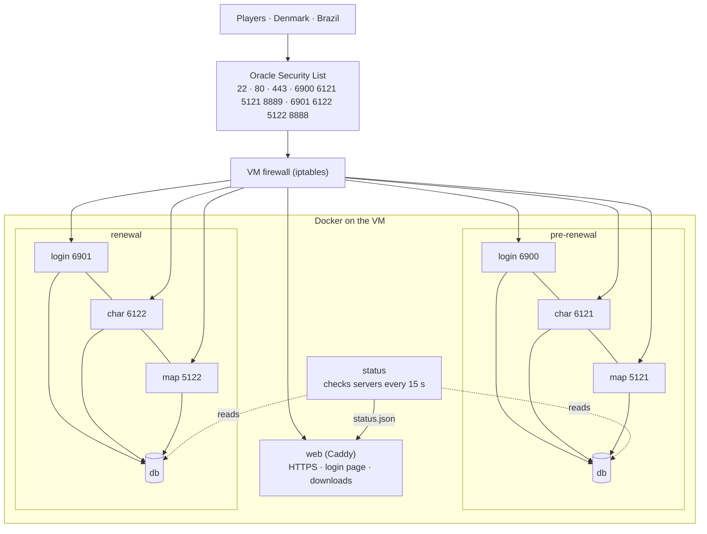
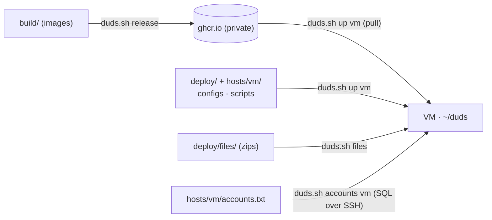

# Operations

## How players reach the server

Databases have no open port; only the game containers and the status checker reach them.

## From your PC to the VM

- Images are the programs; configs live outside them, so config changes need no rebuild.
- The VM never needs the source code.

## Commands (`./duds.sh`)
| Command | Does |
|---|---|
| `release [image…]` | build + push images (`pre_renewal renewal db web`, default all) |
| `up <local\|vm> [service…]` | start/update (vm: copy files, pull, start) |
| `restart <host> <service…>` | e.g. `restart vm prere-map re-map` |
| `start` / `stop <host> <pre\|re\|all>` | run only the server you want; data stays |
| `ps` · `logs` · `online <host>` | status · live logs · players online |
| `config <host> [pre\|re\|gm\|env\|all]` | upload configs only, no restart |
| `accounts <host>` | create/update game accounts from `accounts.txt` (safe to rerun) |
| `add-user <host> <username> <M\|F> [group]` | add/change one account (asks the password; 99 = admin) |
| `set-password <host> <user>` | website login (stored as a token) |
| `package <pre\|re> [address]` · `files` | build a client zip · upload zips (resumable) |
| `backup <host>` · `autobackup vm` | dump databases to your PC · every 6 h on the VM |
| `ssh` | shell on the VM |

Services: `prere-{db,login,char,map,web}`, `re-{db,login,char,map,web}`, `web`, `status`. The `*-web` services are rAthena's web server (account settings + guild emblems for the client; ports 8889 pre-renewal, 8888 renewal).
`up`, `restart` and `stop` ask first if players are online. Multi-step commands show green step headers with a progress bar.

## What friends download
`./duds.sh package pre|re` builds `deploy/files/duds-<edition>.zip`:

| Inside | What |
|---|---|
| `Install RagnaDuds.bat` | Windows installer (window with your photo, progress bar) |
| `install.sh` | Linux installer: retro window like the website (GTK; falls back to Tk, zenity, terminal), own Wine setup + fonts |
| `Uninstall RagnaDuds.bat` · `uninstall.sh` | remove everything (also in the Start menu / Windows Apps / Linux app menu) |
| `game.zip` | the game folder, pointed at the server, with the homunculus AI |
| `installer/` | config, file list for the integrity check, icons, pictures |

Both installers: unpack → check every file → check the server answers → create the **RagnaDuds** shortcut → **Start and YEAAAAAAAAAAH!**
- Run again on the same folder = **REINSTALL**: files replaced, files the new version doesn't have removed; settings, screenshots (and Wine on Linux) kept. Stops if the game is open.
- Game screens: `build/installer/make_assets.py` → `client/login/` (original pictures, resized). They ship inside GRF archives listed first in `DATA.INI` (works on any Windows language setting; loose files in Korean-named folders don't): `ragnaduds.grf` = the warning screen before the login (`login_interface/warning*.bmp`) + fixed item pictures; `ragnaduds_login<N>.grf` = login picture N (`t_login.jpg` for the 2026 client, `bgi_temp.bmp` for older ones). The launcher (`launch.ps1` / `ragnaduds.sh`) sets `DATA.INI` line 0 to a random login GRF at every start.
- Items: `python3 cashshop/build_shop.py` checks every renewal item against the client and fixes missing names, icons and looks (real icons + descriptions from divine-pride, cached), and builds the Cash Shop from `cashshop/shop.yml`. Run it before `./duds.sh package re`.
- Linux needs Wine with 32-bit support (Ubuntu/Debian: `wine32:i386`); the installer says so if it's missing.
- GNOME shows no desktop icons: the game is in the app menu (the installer tells the user).
- **Homunculus AI** (`client/homunculus_ai/`, Mir AI Mod, GPL v2): hunts by itself. Players type `/hoai` once. Change the preset in `Config.lua`, then rebuild the zips.
- Pictures: `build/installer/make_assets.py`. Website pictures: `build/web/README.md`.

## Shortcuts on your PC
| Shortcut | Does |
|---|---|
| `ssh duds` | log in to the VM |
| `ro2021` / `ro2026` | start the local server if needed + the game |
| `rag_client_logs [2026]` | follow the game client log |
