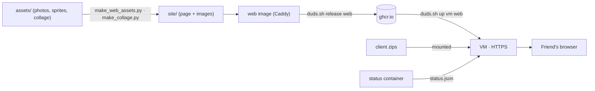

# RagnaDuds website

The friends-only page: login, server status, client downloads, install steps, a mini game, a collage and the Hall of Fame.
Live at https://ragnaduds.duckdns.org. Languages: EN / PT / DA.



## How it works
- **One static page** (`site/index.html`): HTML, CSS and JavaScript in one file. No build step.
- **Caddy** serves it with automatic HTTPS, plus the zips from `/files/` (resumable downloads).
- **Login page** (`site/login.html`): the browser turns ID + password into a token and stores it as a cookie. Caddy only serves the site to that cookie (`DL_TOKEN`). The password is never stored on the server.
- **Server status** and **Hall of Fame** (top 10 by level with MVP/PvP kills, richest, MVP slayers; GMs left out) come from `status/status.json`, written every 15 s by the `status` container (`deploy/status.sh`).
- **Texts**: all in the `T` object at the top of the script (login page: its own small `T`). The page uses the browser's language (Portuguese, Danish, else English) and remembers the choice.
- **Lag-o-meter**: measures your real ping every 5 s.

## Fun parts
- **Mini game** (top): the orc village map. You're the knight on a Peco Peco (your face), with an orc and 3 Porings. Click to walk or attack, or use WASD / arrows. When you bump into a monster there's a 35% chance of a fight. The loser flies off (physics), gets a "RIP", and respawns.
- **Collage**: your photo with a painted-in white potion and halo. The stickers hang on physics springs: grab and throw them. The card drops from the sky.
- **Easter egg**: ↑ ↑ ↓ ↓ ← → ← → B A makes it rain Porings.

## Tech
- **Browser**: [matter.js](https://brm.io/matter-js/) 0.20 (physics, from cdnjs), Google Fonts *Press Start 2P* + *VT323*. Nothing else.
- **Container**: `caddy:2-alpine`, holding only `Caddyfile` + `site/` (`.dockerignore` skips `assets/`).
- **Settings**: `SITE_ADDRESS` (domain = automatic HTTPS) and `DL_TOKEN` (the login, set with `./duds.sh set-password <host> <user>`).
- **Image scripts**: Python 3 + Pillow. New background cutouts also need `pip install "rembg[cpu]"`; results are cached in `assets/collage/cut/`.

## Folders
```
Dockerfile, Caddyfile       the container
site/                       what gets published
assets/                     sources (not published)
  photos/ sprites/ collage/ fonts/
  make_web_assets.py        → icons, NPC face, knight, orc, map
  make_collage.py           → collage (edit LAYOUT to move stickers; positions in 1200×1600 photo pixels)
```

## Change something
- **Picture**: replace it in `assets/`, then run `python3 assets/make_web_assets.py` or `make_collage.py`.
- **Text**: edit `T` in `site/index.html`, in all three languages.
- **Preview**: `./duds.sh up local web status`, then open http://localhost:8088.
- **Put it live**: `./duds.sh release web`, then `./duds.sh up vm web`. The site restarts for about 2 s; the game servers keep running.
